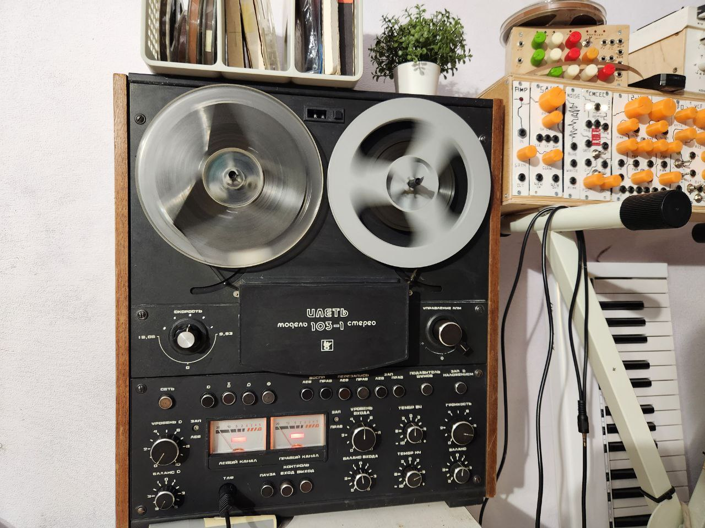
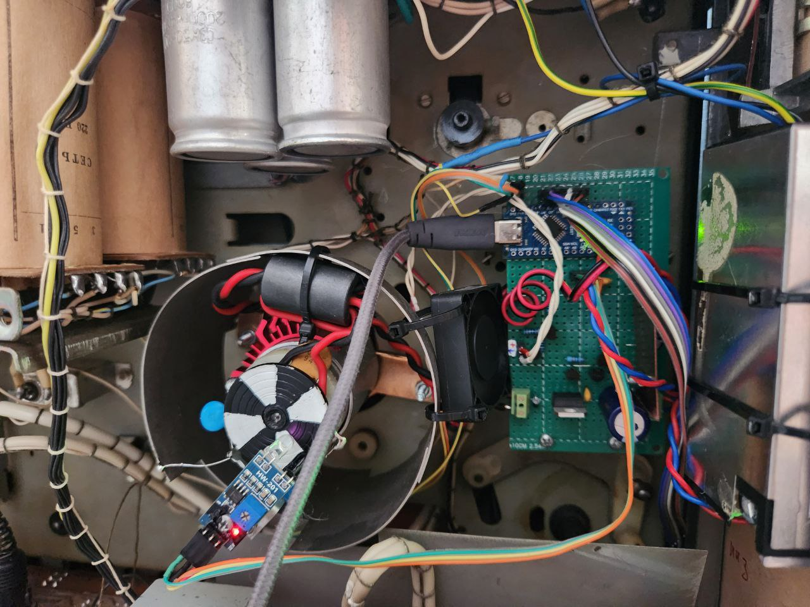
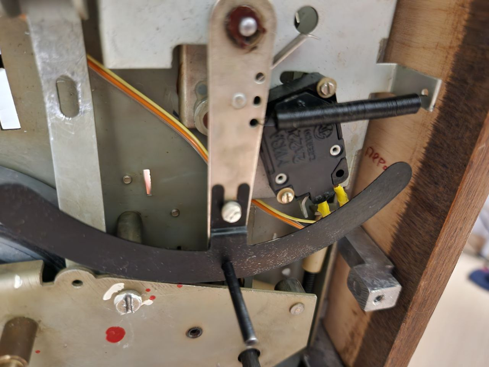
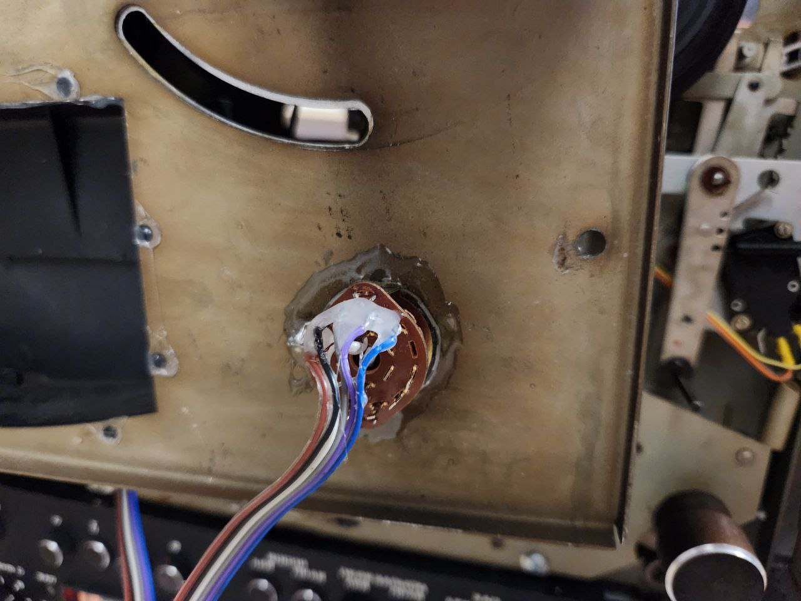
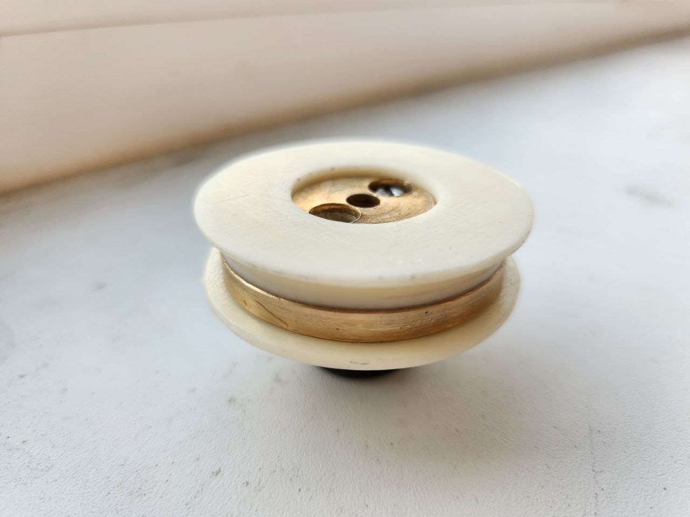
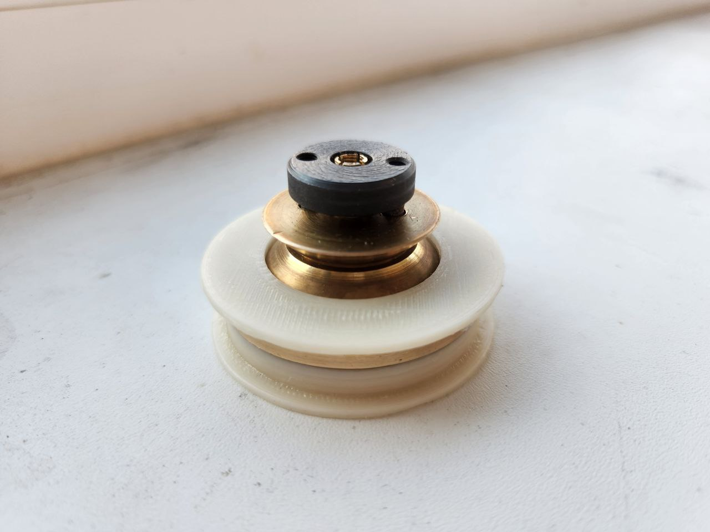
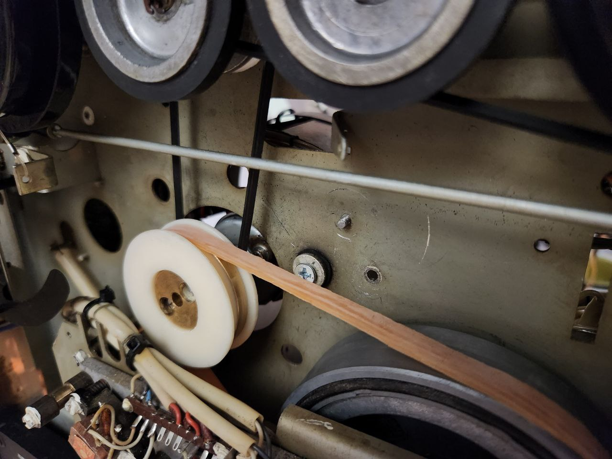

# ➿ ilet-103-motor-controller

## Digital speed controller for ILET 103 reel-to-reel deck | Цифровой контроллер скорости ленты катушечного магнитофона ИЛЕТЬ 103

----------

## ❓ Что это

Данный репозиторий содержит инструкцию по переделке катушечного магнитофона на примере ИЛЕТЬ 103-1 для добавления цифровой регулировки скорости, замены асинхронного двигателя на двигатель постоянного тока, роликовой передачи на пассик, а также, исходный код контроллера с ПИД-регулятором скорости.

Кроме ИЛЕТЬ 103-1, данная переделка возможна **для любых других катушечных магнитофонов** с подобным устройством и принципом работы.



----------

## ⚠️ Дисклеймер

> Авторка репозитория не несёт ответственности за любой причинённый моральный / материальный / физический или иной ущерб, связанный с использованием данного репозитория / кода / 3д-моделей / схем / иных других материалов. Вы всё делаете на свой страх и риск!
> Сетевое напряжение может быть **смертельно**!

----------

## 🔧 Замена двигателя и роликового привода на пассик, сборка контроллера

### Контроллер двигателя

1. Подберите мощный двигатель постонного тока. Например, от старого принтера. Обычно для питания таких двигателей можно использовать блок питания напряжением 24V и током не менее 2А.

> ВАЖНО ⚠️: Для питания двигателя используйте отдельный экранированный блок питания, PEN проводник которого необходимо соединить с общим корпусом магнитофона и сетевым проводником PEN.

2. На заднюю часть двигателя установите готовый или самодельный оптический энкодер. Я использовала самодельный энкодер, содержащий 4 чёрных и 4 белых сегмента;
3. Соберите контроллер, используя схему ниже:
  

4. Собранный и установленный контроллер и мотор должны выглядеть следующим образом:
  

> Ваши компоненты, их номиналы и т.д. могут отличаться. Экспериментируйте!

Ниже представлены фото подключенного переключателя включения мотора и переключателя скорости. Переключатель паузы подключен последовательно с кнопкой включения мотора

> ВАЖНО ⚠️: Отключите и заизолируйте от переключателя паузы все остальные провода, т.к. на них высокий потенциал!

|  |  |
|-----------------------------------------------|----------------------------------------------------------|

> Если в процессе работы мотор нагревается, можно установить небольшой кулер

### Шкив и пассик вместо роликового привода

> В ИЛЕТЬ 103-1 изначально крайне шумный привод капстана. Чтобы убрать шум (также, после установки контроллера и мотора постоянного тока необходимости в механическом изменении скорости нет), необходимо заменить привод на пассик, в качестве которого можно отрезать 8-10мм диэлектрической перчатки

1. Распечатайте на 3Д-принтере или изготовьте иным образом детали шкива `3d/ILET103-Top.stl` и `3d/ILET103-Bottom.stl`;
2. Соберите шкив, как показано на фото ниже:

|  |  |
|----------------------------------------------------|------------------------------------------------------|

3. Отключите и уберите электромагнит паузы
4. Установите пассик:


----------

## 🏗️🟠 Сборка при помощи PlatformIO

1. Клонируйте репозиторий с модулями:

  ```shell
  git clone --recursive https://github.com/F33RNI/ilet-103-motor-controller.git
  cd ilet-103-motor-controlle
  ```

- IDE версия:
  - Откройте репозиторий `ilet-103-motor-controller` в IDE и запустите сборку.

- Консольная версия (PlatformIO Core):

  ```shell
  pio run
  ```

----------

## 🏗️🔵 Сборка при помощи Arduino IDE / arduino-cli

1. Клонируйте репозиторий с модулями:

  ```shell
  git clone --recursive https://github.com/F33RNI/ilet-103-motor-controller.git
  cd ilet-103-motor-controlle
  ```

- IDE версия
  - Откройте файл `ilet-103-motor-controller.ino` в IDE, выберите нужную платформу и запустите сборку.

- Консольная версия (arduino-cli)

  - Создайте директорию `build`:

  ```shell
  mkdir build
  ```

  - Запустите сборку (заменив `arduino:avr:uno` на требуюмую платформу):

  ```shell
  arduino-cli compile --verbose --build-path ./build -b arduino:avr:uno ilet-103-motor-controller.ino
  ```

----------

## ⚙️ Настройка контроллера и ПИД-регулятора

- Все настройки находятся в файле `include/config.h`
- Настройки портов находятся в файле `include/pins.h`

Если, указанные в настройках, параметры ПИД не подошли для вашей сборки, настройте ПИД вручную. Для этого:

1. Включите режим `DEBUG`. Используйте любую программу плоттера последовательного порта, чтобы следить за графиками скорости;
2. Установите все параметры в 0 (`PID_P_GAIN = 0.f`, `PID_I_GAIN = 0.f` и `PID_D_GAIN = 0.f`);
3. Установите среднюю скорость;
4. Постепенно повышайте `PID_P_GAIN` до тех пор, пока не начнутся осцилляции;
5. Уменьшите `PID_P_GAIN` до тех пор, пока осцилляции не пропадут полностью и ещё немного;
6. Увеличьте `PID_I_GAIN` так, чтобы скорость достигалась максимально быстро без осцилляций;
7. Плавно повышайте `PID_D_GAIN`, `PID_P_GAIN` и `PID_I_GAIN`, стараясь добиться максимальной стабильности и скорости реакции.

> ВАЖНО ⚠️: Указанный алгоритм настройки ПИД-регулятора крайне не оптимален. К сожалению я не знаю как это сделать более правильно или автоматизировать в коде. Если вы хотите помочь с настройкой ПИД-регулятора, сделайте пул-реквест или свяжитесь со мной.

----------

## ✨ Участие в разработке

1. Клонируйте репозиторий с модулями:

  ```shell
  git clone --recursive https://github.com/F33RNI/ilet-103-motor-controller.git
  ```

2. При редактиовании / добавлении кода, следуйте стилю, указанному в `.clang-format`;
3. При создании коммитов, используйте стиль [Conventional Commits](https://www.conventionalcommits.org/en/v1.0.0/#specification>)
4. Создайте пул-реквест.
